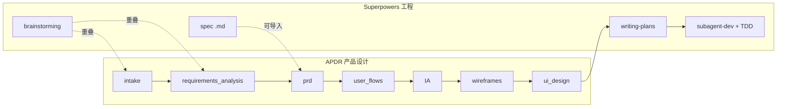

# Skill Integration Tracker

## Superpowers（已分析）

| 项目 | 内容 |
|------|------|
| 名称 | [Superpowers](https://github.com/obra/superpowers) |
| 类型 | 整套 **工程交付** 方法论（Skills 库 + 强制流程），不是产品设计专用 runtime |
| Cursor 安装 | Agent 内 `/add-plugin superpowers`（全局插件，需你在 IDE 执行） |
| 本仓库 | 已克隆至 `vendor/superpowers/`（`scripts/install-superpowers.sh` 可更新） |
| 许可 | MIT |

### 它解决什么

在**写代码之前**强制：澄清意图 → 分段设计 → 书面 spec → 可执行实现计划 → TDD 实现 → 子 agent 分任务 + 双阶段 review → 合分支。

核心哲学：TDD、YAGNI、DRY、证据优于声称、流程优于即兴。

### Skills 清单（14 个）

| Skill | 类别 | 一句话 |
|-------|------|--------|
| `using-superpowers` | Meta | 任何任务前先查并 invoke 相关 skill |
| `brainstorming` | 设计前 | 一问一答澄清，2–3 方案，分段呈现设计，写 spec 文件 |
| `writing-plans` | 计划 | 把已批准 spec 拆成 2–5 分钟粒度的实现任务（含完整代码/命令） |
| `using-git-worktrees` | 环境 | 独立 worktree + 干净测试基线 |
| `subagent-driven-development` | 执行 | 每任务新 subagent + spec 合规 review + 代码质量 review |
| `executing-plans` | 执行 | 同计划、批量 checkpoint（偏人工卡点） |
| `test-driven-development` | 实现 | 红绿重构，禁止先写实现再补测 |
| `requesting-code-review` | 协作 | 任务间 review 清单 |
| `receiving-code-review` | 协作 | 处理 review 反馈 |
| `dispatching-parallel-agents` | 执行 | 并行 subagent |
| `systematic-debugging` | 调试 | 四阶段根因分析 |
| `verification-before-completion` | 质量 | 完成前必须验证 |
| `finishing-a-development-branch` | 收尾 | merge/PR/保留/丢弃 |
| `writing-skills` | Meta | 编写新 skill 的规范 |

### 与 APDR 流水线对照



| APDR 阶段 | Superpowers 覆盖？ | 建议 |
|-----------|-------------------|------|
| intake | 部分（`brainstorming` 探索上下文） | 用 SP 做对话式澄清，产出写入 `ProjectBrief` artifact |
| requirements_analysis | 部分（澄清问题、方案对比） | SP 负责过程；APDR 负责结构化 `RequirementsAnalysis` |
| prd | 弱（SP spec 偏**技术设计**非产品 PRD） | **保留 APDR `product_writer`**；可从 SP spec 摘录导入 PRD |
| user_flows / IA / wireframes / ui_design | **无** | 纯 APDR + 你后续 Figma/gstack 等 skill |
| frontend_codegen | **强** | **主绑定**：`writing-plans` → `using-git-worktrees` → `subagent-driven-development` + `TDD` |

### 关键差异（集成时必须处理）

1. **存储模型**：SP 写 `docs/superpowers/specs/`、`docs/superpowers/plans/`；APDR 写 `projects/{id}/artifacts/*.json`。需要 **适配层**（spec/plan → artifact 或双向链接）。
2. **审批语义**：SP = 对话里「用户批准设计」；APDR = `approve_artifact` + `advance`。应在 `brainstorming` 结束后显式 `write_artifact` + `approve_artifact`。
3. **范围**：SP 明确 **禁止** 在设计批准前写代码；与 APDR「先产品后代码」一致，可串联。
4. **没有 UX 资产**：SP 的 Visual Companion 是通用浏览器 mockup，不替代 `UserFlows` / `Wireframes` / `UIDesignSpec`。

### 推荐集成策略（分三期）

**Phase 1（立即可用，不改 SP 源码）**

- Cursor 安装 Superpowers 插件（全局 skill 自动触发）。
- 在 `skills/requirements-analyst/SKILL.md` 增加：**先 invoke `superpowers:brainstorming`**，结束后把结论写入 `RequirementsAnalysis` / `ProjectBrief`（经 `design-artifacts` MCP）。
- 在 `skills/frontend-engineer/SKILL.md` 增加：上游为 approved `UIDesignSpec` → **invoke `writing-plans`**（输入 = UI spec + PRD 摘要）→ 计划落盘后可 `scaffold_frontend` → **invoke `subagent-driven-development`**。

**Phase 2（仓库内适配）**

- 新增 capability `govern.import.superpowers_spec`：读取 `docs/superpowers/specs/*.md` → 生成/更新 `PRD` 或 `RequirementsAnalysis` draft。
- `CodeBundle` artifact 增加字段 `implementationPlanPath` 指向 SP plan 文件。

**Phase 3（可选 fork）**

- 扩展 `brainstorming` 输出模板，直接对齐 `PRDContent` JSON schema（需维护 fork，SP 上游较少接受新 skill PR）。

### Agent 绑定建议

| Agent ID | Superpowers skills | 优先级 |
|----------|-------------------|--------|
| `requirements_analyst` | `brainstorming` | P0 |
| `product_writer` | （无直接对应）| 保持 APDR 原生 |
| `frontend_engineer` | `writing-plans`, `using-git-worktrees`, `subagent-driven-development`, `test-driven-development`, `finishing-a-development-branch` | P0 |
| `orchestrator` | `using-superpowers`, `verification-before-completion` | P1 |
| 全局调试 | `systematic-debugging` | P1 |

### 状态

| 集成项 | 状态 |
|--------|------|
| 分析文档 | done |
| GitHub 克隆 `vendor/superpowers` | done |
| Cursor `/add-plugin superpowers` | **需你本机在 Agent 里执行** |
| 修改 `agents/definitions.ts` 标注 `externalSkills` | pending |
| 更新各 `skills/*/SKILL.md` 包装 SP | pending |
| spec/plan → artifact 导入工具 | pending |

---

## baoyu-skills（已分析，未安装）

| 项目 | 内容 |
|------|------|
| 仓库 | [JimLiu/baoyu-skills](https://github.com/JimLiu/baoyu-skills) |
| 定位 | **内容生产 + AI 出图 + 社媒发布** 工具箱（22 个 skill），不是产品方法论 |
| 依赖 | Node.js + `bun`/`npx`（多数 skill 跑 TS 脚本） |
| Cursor 安装 | `/plugin marketplace add JimLiu/baoyu-skills` → `/plugin install baoyu-skills@baoyu-skills` |
| 与 Superpowers | **不冲突**（领域正交）；注意 **触发顺序**（见下） |
| 本仓库状态 | **已 vendored** `vendor/baoyu-skills/` + APDR `skills/*` 已绑定 |

### 结论摘要

| 问题 | 答案 |
|------|------|
| 有用吗？ | **有，但只挑 5–7 个** 接入 APDR；整包安装会噪音大、与「产品设计 runtime」目标偏离 |
| 与 Superpowers 冲突？ | **无硬冲突**；SP 管工程纪律，baoyu 管视觉资产与发布 |
| 重复？ | **局部重复**（图表、调研抓取、部分 mockup）；与 APDR 占位 skill 也有重叠 |
| 划到哪个模块？ | 主要在 **user_flows / IA / wireframes / ui_design** + **intake 调研**；**不要**绑到 `frontend_codegen` 核心路径（交给 SP） |

### 三类 skill（22 个）

**Content（内容与出图）** — 与 APDR 设计链最相关  
`baoyu-diagram`, `baoyu-infographic`, `baoyu-slide-deck`, `baoyu-cover-image`, `baoyu-article-illustrator`, `baoyu-xhs-images`, `baoyu-comic`, `baoyu-image-cards`, `baoyu-post-to-wechat/weibo/x`

**AI Generation（底层出图 API）** — 供上层 content skill 调用  
`baoyu-imagine`, `baoyu-image-gen`

**Utility（工具）** — 调研与格式  
`baoyu-url-to-markdown`, `baoyu-format-markdown`, `baoyu-markdown-to-html`, `baoyu-translate`, `baoyu-compress-image`, `baoyu-wechat-summary`, `baoyu-youtube-transcript`, `baoyu-danger-*`

### 与 Superpowers 对照

| 维度 | Superpowers | baoyu-skills |
|------|-------------|--------------|
| 目标 | 写代码前的 spec + TDD + 子 agent 实现 | 配图、信息图、幻灯片、社媒发稿 |
| 触发 | 几乎任何开发任务 | 「画图」「出图」「发公众号」等 |
| 产出 | `docs/superpowers/*.md` + 代码 | 图片/SVG/PPTX/浏览器发稿 |
| 与 APDR artifact | 需适配导入 PRD | 需把路径写入 `UIDesignSpec` / `Wireframes` references |

**顺序建议（避免打架）**  
1. APDR：`ProjectBrief` → … → `UIDesignSpec` **approved**  
2. Superpowers：`writing-plans` → `subagent-driven-development`（**仅应用代码**）  
3. baoyu：**可选** 营销物料（slide-deck、xhs、infographic），**不替代** `UIDesignSpec`

### 重复矩阵

| baoyu skill | 重叠对象 | 程度 | 建议 |
|-------------|----------|------|------|
| `baoyu-diagram` | APDR `ux_strategist`（Mermaid）、SP Visual Companion | 中 | **保留 baoyu** 做对外 SVG 架构/序列图；artifact 里存 Mermaid + `diagram/*.svg` 路径 |
| `baoyu-infographic`（`ui-wireframe` 风格） | APDR `wireframe_designer`（HTML 线框） | 低–中 | 产品 UI 线框 **不用** infographic；仅当要「宣传用信息图」 |
| `baoyu-imagine` / `image-gen` | Figma MCP、gstack design-shotgun | 中 | UI 高保真优先 Figma；baoyu 做 **无 Figma 时** 的概念图/封面 |
| `baoyu-slide-deck` | — | 无 | PRD/方案 **演示稿** 导出，不进 `Wireframes` |
| `baoyu-url-to-markdown` | APDR `research` MCP stub | 高 | **替换 research stub** 做竞品/参考页抓取 |
| `brainstorming`（SP） | — | 无 | 需求阶段只用 SP，不用 baoyu |
| `writing-plans` + TDD（SP） | — | 无 | 代码阶段只用 SP |
| `post-to-wechat/x/weibo` | — | 无 | 划出 APDR，属 **发布流水线**（MCP `publish` 未来） |
| `xhs-images`, `comic` | — | 无 | 自媒体运营可选模块 |

### 推荐接入 APDR 的模块划分

| APDR 阶段 | Agent | 推荐 baoyu skill | 优先级 | 写入 artifact |
|-----------|-------|------------------|--------|---------------|
| intake / requirements_analysis | `requirements_analyst` | `baoyu-url-to-markdown`, `baoyu-youtube-transcript` | P1 | `ProjectBrief.references` |
| user_flows | `ux_strategist` | `baoyu-diagram`（flowchart/sequence） | P0 | `UserFlows` + 附件路径 |
| information_architecture | `information_architect` | `baoyu-diagram`（structural/tree） | P1 | `IA` + sitemap SVG |
| wireframes | `wireframe_designer` | **不用** infographic；可选 `baoyu-diagram` ui-wireframe 仅概念示意 | P2 | `Wireframes.htmlPath` 为主 |
| ui_design | `visual_designer` | `baoyu-imagine`（概念屏）、`baoyu-cover-image` | P1 | `UIDesignSpec.screens[].reference` |
| prd | `product_writer` | `baoyu-slide-deck`（`--outline-only` 先大纲） | P2 | 链接到 PRD，非替代 PRD JSON |
| frontend_codegen | `frontend_engineer` | **不绑 baoyu** | — | 只用 Superpowers |
| （产品外）发布 | — | `post-to-wechat` 等 | 可选 | 独立 workflow |

### 不建议默认安装的 baoyu skill

- 社媒全套（除非你的产品 runtime 含「运营发稿」）
- `baoyu-danger-*`（合规/风控风险，仅明确需要时）
- `baoyu-comic` / `baoyu-xhs-images`（与 B2B 产品设计链无关）

### 安装建议

- **不要**与 Superpowers 二选一；**按阶段共存**  
- 安装方式：`/plugin install baoyu-skills@baoyu-skills`（Cursor）或 `npx skills add jimliu/baoyu-skills`  
- 配置：各 skill 的 `.baoyu-skills/*/EXTEND.md` + API Key（`baoyu-imagine` 等）

---

## 映射表（其他 skill）

| Skill 名 | GitHub | Pipeline 阶段 | Agent ID | 状态 |
|----------|--------|---------------|----------|------|
| Superpowers | https://github.com/obra/superpowers | intake–req, frontend_codegen | requirements_analyst, frontend_engineer | vendored |
| baoyu-skills（精选 5） | https://github.com/JimLiu/baoyu-skills | intake–prd, user_flows–ui_design | requirements_analyst, ux_strategist, information_architect, visual_designer, product_writer | integrated |

## 集成检查清单

对每个 skill：

1. **阶段匹配** — 是否覆盖 `requirements_analysis` … `frontend_codegen` 之一？
2. **输入** — 能否读取 `get_latest_artifact` 的上游类型？
3. **输出** — 能否通过 `write_artifact` 写入对应 `ArtifactType`？
4. **MCP** — 需要 `design-artifacts` only，还是还要 `research` / `figma` / `preview`？
5. **Gate** — 产出物是否需要 `approve_artifact` 后才能 `advance`？
6. **冲突** — 与现有 `skills/` 占位是否重复，合并还是替换？

## Agent ↔ Skill 路径（当前占位）

| Agent | skillPath | Superpowers（建议） |
|-------|-----------|---------------------|
| requirements_analyst | `skills/requirements-analyst/SKILL.md` | `brainstorming` |
| product_writer | `skills/prd-writer/SKILL.md` | — |
| ux_strategist | `skills/ux-flow/SKILL.md` | — |
| information_architect | `skills/information-architect/SKILL.md` | — |
| wireframe_designer | `skills/wireframe-designer/SKILL.md` | — |
| visual_designer | `skills/visual-designer/SKILL.md` | — |
| frontend_engineer | `skills/frontend-engineer/SKILL.md` | `writing-plans`, `subagent-driven-development`, TDD, worktrees |
| code_intelligence_analyst | `skills/code-intelligence/SKILL.md` | CodeGraph CLI + `build_code_intelligence_report` |

---

## CodeGraph（已集成 — 源码级 pipeline 阶段）

| 项目 | 内容 |
|------|------|
| 名称 | [CodeGraph](https://github.com/colbymchenry/codegraph) |
| APDR 阶段 | **`code_intelligence`**（第 10 阶段，在 frontend_codegen 与 handoff 之间） |
| 产出 | `CodeIntelligenceReport` artifact |
| 自动化 | repo MCP `build_code_intelligence_report` — init + explore + 结构化 JSON |
| 安装 | `npm run install-codegraph` 或 `bash scripts/install-codegraph.sh` |
| 降级 | CodeGraph 未安装时仍产出报告（文件系统扫描），不阻塞流水线 |

### 流水线位置

```
frontend_codegen → code_intelligence → handoff → quality_eval
     CodeBundle    CodeIntelligenceReport   HandoffDoc
```

### 源码改动点

- `packages/core/src/workflows/pipeline.ts` — 新增 stage step
- `packages/mcp-shared/src/codegraph.ts` — CLI 封装
- `packages/mcp-servers/repo` — MCP 工具
- `skills/code-intelligence/SKILL.md` — Agent 指令（自动 approve + advance）

### 状态

| 集成项 | 状态 |
|--------|------|
| pipeline stage + artifact type | done |
| repo MCP automation | done |
| handoff / quality_eval 消费 | done |
| 用户安装 CodeGraph CLI | 可选（有降级） |
