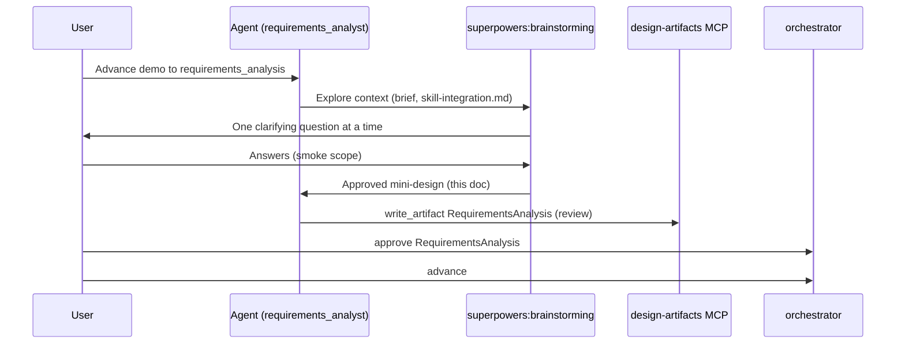

# Design: Superpowers → APDR handoff for `demo` requirements_analysis

**Date:** 2026-05-26  
**Status:** Draft (brainstorming output — awaiting user approval before `writing-plans`)  
**Scope:** Advance `projects/demo` from `intake` to a reviewable `RequirementsAnalysis` artifact using Superpowers discipline.

## Context (brainstorming step 1)

| Signal | Finding |
|--------|---------|
| Runtime | `demo` at stage `intake`; gate `draft`; only artifact `ProjectBrief` v1 |
| Brief content | Title "Demo Product", problem "M0 smoke test"; goals/personas/constraints empty |
| APDR skill | `skills/requirements-analyst/SKILL.md` already requires **superpowers:brainstorming** first, then MCP `write_artifact` |
| Plugin | Cursor Superpowers plugin now installed; vendored copy at `vendor/superpowers/` |
| Gap | No written SP spec exists; brainstorming dialogue was never run for `demo` |

**Success criteria for this handoff**

1. `RequirementsAnalysis` artifact exists with non-empty problems, assumptions, and open questions.
2. Provenance records `brainstorming` (and any baoyu research tools used).
3. User can run `approve` + `advance` without bypassing human gates.
4. No application code written before requirements are approved.

## Approaches considered (brainstorming step 4)

### A — Minimal smoke (recommended)

Run a **short** brainstorming pass (3–5 clarifying answers) scoped only to validating the APDR pipeline, not a real product.

- **Pros:** Fastest proof that SP + MCP + orchestrator work end-to-end.
- **Cons:** Artifacts are synthetic; not useful as product documentation.

### B — Realistic sample product

Pick a concrete fictional product (e.g. "internal news digest for sales") and run full brainstorming (one question at a time, 2–3 approach comparison).

- **Pros:** Exercises real `RequirementsAnalysis` fields; better template for future projects.
- **Cons:** 15–30 minutes of user Q&A before any artifact write.

### C — Import existing markdown spec

If the user already has a PRD or notes, skip live Q&A; map sections into `RequirementsAnalysis` JSON and cite source in provenance.

- **Pros:** Skips redundant dialogue when input exists.
- **Cons:** Skips SP's assumption-surfacing; only valid when source doc is already reviewed.

**Recommendation:** **A** for the `demo` project ID (it's explicitly M0 smoke). Use **B** for the next non-demo project.

## Design (brainstorming step 5)

### Flow

### Artifact mapping (SP dialogue → APDR JSON)

| RequirementsAnalysis field | Source from brainstorming |
|---------------------------|---------------------------|
| `summary` | One paragraph: what we're validating and for whom |
| `problems` | User pain points stated during Q&A (or explicit "pipeline validation" for smoke) |
| `jobsToBeDone` | 1–2 jobs the demo "user" needs |
| `assumptions` | e.g. "MCP design-artifacts is enabled", "no production deploy" |
| `risks` | e.g. empty brief fields, plugin not loaded in agent session |
| `openQuestions` | Anything deferred (e.g. real product name later) |
| `provenance.tools` | `["brainstorming"]` plus baoyu tools if used |

### Storage boundary (no dual truth)

- **Canonical product state:** `projects/demo/artifacts/*.json` via MCP only.
- **SP spec (this file):** Process record + approved design; optional `references` entry on brief pointing here.
- **Do not** treat `docs/superpowers/specs/` as approved requirements without mirroring into an artifact.

### Hard gates preserved

- No `frontend_codegen`, no `writing-plans`, no code until `RequirementsAnalysis` status is `approved`.
- Brainstorming does not replace `approve_artifact`; it precedes `write_artifact`.

## Smoke-test clarifying answers (pre-filled for demo)

If the user accepts approach **A**, these defaults unblock artifact write without more Q&A:

1. **Purpose of demo?** Validate APDR + Superpowers + MCP wiring, not ship a product.
2. **Primary user?** Internal developer running orchestrator locally.
3. **Must-have outcome?** Approved `RequirementsAnalysis` and successful `advance` to next stage.
4. **Out of scope?** Real UI, production data, Gitee/Java review.
5. **Success metric?** `npm run orchestrator -- status --project demo` shows stage past `requirements_analysis` with approved gate.

## Spec self-review

- [x] No TBD sections; scope is single handoff.
- [x] Consistent with `docs/skill-integration.md` Phase 1.
- [x] No contradiction with `requirements-analyst` SKILL (brainstorm → write_artifact → approve).
- [x] Small enough for one implementation plan (next: `writing-plans`).

## Next step

After you approve this design:

1. Invoke **superpowers:writing-plans** to produce a 2–5 minute task plan (MCP calls + sample JSON only).
2. Execute plan with **verification-before-completion** before claiming demo advanced.
