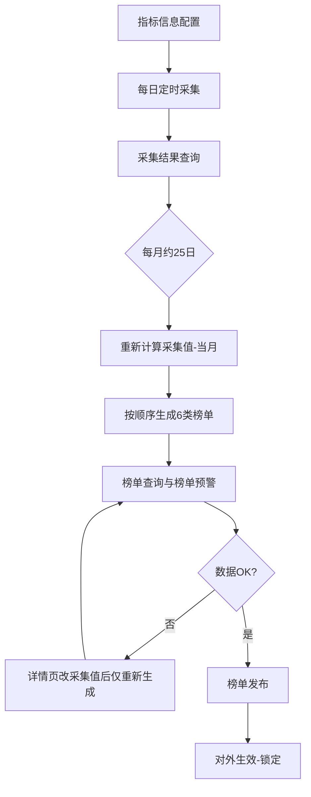

# 工作交接文档

> 本文档随交接材料持续更新。每次补充会在文末「更新记录」中登记。

---

## 一、基本信息

| 项目 | 内容 |
|------|------|
| 交接类型 | **离职交接** |
| 交接人 | **张超阳** |
| 接交人 | **姚小龙** |
| 所属部门/团队 | **迈点项目组** |
| 岗位/角色 | **产品经理** |
| 直属上级 | **万总** |
| 计划交接完成日期 | **2026-06-12** |
| 文档版本 | v0.10 |
| 最后更新 | 2026-06-03 |

---

## 二、工作概述

### 2.1 岗位职责摘要

负责两大板块的产品工作：**迈点对外业务** + **公司内部系统**。涵盖需求分析、方案设计、跨端（Web 前台/后台、小程序）协调、与研发/设计/业务方协作及上线跟进等；**迈点网后台账号开通**亦由产品经理负责（见 §7.1）。具体流程见第三章、第六章。

### 2.2 工作边界说明

- **主要负责**：
  - **迈点业务线**（对外）：迈点网、迈点指数、迈点文旅资产链、迈点 AI 助手 — 各产品均含**前台 + 后台**；其中迈点网、迈点文旅资产链、迈点 AI 助手另含**小程序端**。
  - **内部系统板块**（公司内部使用）：CRM 系统、绩效系统、OA 系统、广告系统、CMS 系统、东方网升管理后台。
- **协作配合**：向 **万总** 汇报；与研发（如郝明瑞、兰丽）、内容（郭主编）等协作；**CRM 产品负责人为产品经理**（现 **张超阳**，交接后 **姚小龙**）。
- **不负责/已移交**：_（待补充）_

### 2.3 业务性质与红线提示

| 板块 | 面向对象 | 说明 |
|------|----------|------|
| 迈点相关业务 | **对外**（C 端/行业用户/客户等） | 含公网前台、运营后台及小程序；需注意品牌、内容、用户数据与对外发布节奏 |
| 内部系统板块 | **对内**（公司员工/内部运营） | CRM、绩效、OA、广告、CMS、东方网升管理后台等；侧重流程、权限与内部效率 |

> 合规细则、审核流程、对外发布红线等见 **第十章**（待第 5～6 步补充）。

---

## 三、日常工作与流程

### 3.1 例行工作

| 频率 | 事项 | 操作说明 | 产出/归档位置 | 备注 |
|------|------|----------|---------------|------|
| **每日** | 新闻获取与资讯库 | 关注爬虫/日更；资讯整理库 **≥2000 条**，不足联系技术补录 | 迈点指数后台 / 资讯库 | 见 §4.3 |
| **每日** | 榜单相关数据采集 | 盯采集任务是否完整；异常数据查原因并推动修复 | 迈点指数后台 | 见 §4.3 |
| **每月（约 25 日起）** | 月榜生成、预警检查、发布 | 重新计算采集值 → 按顺序生成 6 类榜单 → 榜单查询/预警核对 → 发布 | 迈点指数后台 | **完整 SOP 见 §3.2** |
| **每年 6 月、11 月** | 数据清洗 | 全量数据清洗（周期性，非仅单次项目） | — | 与当月 P0 清洗任务对齐 |
| **每个节假日前 2～3 天** | 假期总机转接（含最佳东方/先之） | **最佳东方**号码问 **韩蒙** 或查腾讯文档；**先之** 默认 15068821304 → 在「西湖：东方网升对接群」申请 | 见 §3.2.5 | 电信仅支持配置 **最近一周** |
| _待补充_ | 其他例会、审稿、需求评审等 | | | |

### 3.2 关键流程（SOP）

#### 3.2.1 迈点指数 · 榜单月更全链路（产品经理 / 郭主编操作）

**榜单范围与节奏**

| 项 | 说明 |
|----|------|
| 榜单类型 | 仅下列 6 类（无其它榜单）：**酒店 MCI**、**文旅集团**、**公寓**、**酒店**、**县域**、**景区** |
| 更新频率 | **月更** |
| 操作角色 | 一般由 **产品经理** 或 **郭主编** 在后台执行 |

**阶段一：规则与日常采集（持续）**

| 步骤 | 后台模块 | 操作要点 |
|------|----------|----------|
| 1 | **【指标信息配置】** | 配置榜单规则：榜单占比、参考值、可控系数等；计算口径见 [计算规则表（腾讯文档）](https://doc.weixin.qq.com/sheet/e3_AP8A2Qa3ABQCNuz9XWXDGR1KG4UJj?scode=ALYAsQdRAA8UMNCYqRABwAsAaeABc&tab=BB08J2) |
| 2 | **定时任务（每日采集）** | 不同数据源对应不同定时任务；日常关注采集是否正常。**抖音采集任务为每周四**，近期频发问题，需重点盯。任务清单见 [迈点定时任务（企业微信智能表格）](https://doc.weixin.qq.com/smartsheet/s3_AYAA8gZXAHcCNysCDK6pdR3G4xX51?scode=ALYAsQdRAA81NHn1JtABwAsAaeABc&tab=q979lj&viewId=vukaF8) |
| 3 | **【采集结果查询】** | 按品牌逐条查看采集结果；异常时先排查再进入月榜流程 |

**阶段二：月榜生成（每月约 25 日起）**

| 顺序 | 操作 | 说明 |
|------|------|------|
| ① | **重新计算采集值** | 选择**当前月份**，先执行重算 |
| ② | **逐一生成榜单** | 按 **从快到慢** 顺序生成，避免并行拖垮：**酒店 MCI → 文旅集团 → 公寓 → 酒店 → 县域 → 景区** |
| ③ | **【榜单查询】【榜单预警】检查** | 对照上月与预警项；涨幅标红、比例异常须查原因（见 §3.2.2） |
| ④ | 修正数据（如需） | 在 **榜单详情页** 修改采集值后 **再次生成榜单**。**勿再点「重新计算采集值」**，否则恢复为修改前统计；仅当统计本身出错时才重算 |
| ⑤ | 确认无误后进入发布 | — |

**阶段三：发布与撤回**

| 操作 | **【榜单发布】** 打开发布开关 |
|------|------------------------------|
| 发布后 | 榜单数据 **不可修改**、**不可再生成榜单** |
| 需改数 | **先撤回发布** → 修改采集值 → 重新生成榜单 → 再发布 |



#### 3.2.2 榜单审核与异常判断

| 场景 | 处理方式 |
|------|----------|
| **发布前审核** | 主要 **对比上月数据**；结合 **【数据预警】** 中标红项，涨跌幅过大须查原因 |
| **采集值确有变化** | 属正常，可发布 |
| **新闻量异常** | 日新闻量 **明显下降**，或 **每日资讯整理库文章量 < 200** → 判定不正常，联系技术（先 **郝明瑞**） |
| **爬虫/任务明细** | 全量任务清单与异常排查：**郝明瑞**（后续输出文档） |

#### 3.2.3 数据清洗 & 全域数据库（与榜单衔接）

| 项目 | 节奏 / 说明 |
|------|-------------|
| **数据清洗** | **每年 6 月、11 月** 固定执行（全量清洗）；2026 年 6 月当前项为当期必完成事项 |
| **全域数据库** | 按业务需求字段清单采集酒店、景区数据，用于 **报告撰写** 与 **品牌数字化服务系统**；字段表：[全域数据库需求（腾讯文档）](https://doc.weixin.qq.com/sheet/e3_ABwAsAaeABcwG3s2YfkREScvNBkkZ?scode=ALYAsQdRAA8s0ghtO1ABwAsAaeABc&tab=3hiifl) — 按表逐项获取 |

#### 3.2.5 节假日总机转接（CRM 电话能力 · 非 CRM 产品负责人）

> **职责区分**：**CRM 系统产品负责人 = 产品经理**（张超阳 → 姚小龙）。**韩蒙** 不负责 CRM 产品，仅在配置 **最佳东方总机** 假期转接号码时需要对接。

**触发时机**：每次 **节假日前** 由产品经理在对接群发起配置（与 CRM 电话/总机能力相关）。

| 项 | 说明 |
|----|------|
| **最佳东方总机转接号** | 节前找 **韩蒙** 确认；或查阅 [节假日转接配置表（腾讯文档）](https://doc.weixin.qq.com/sheet/e3_AKEADQavABQCNLepDzfhyRGOZJyeB?scode=ALYAsQdRAA8jBt5ab9ABwAsAaeABc&tab=BB08J2)（示例：`18989472610`） |
| **先之总机（默认）** | 固定转接 **15068821304**（**张小远** 手机），**无需找韩蒙** |
| **提前量** | 假期开始前 **2～3 天** 发起配置；**不可过早** — 电信侧转接 **仅能配置最近一周内**，超出范围无法配置 |
| **申请渠道** | 微信群：**「西湖：东方网升对接群」** — @ 对接同事协助配置电信转接 |

**群内话术模板**（按当期假期改名称、日期与号码）：

```text
麻烦帮忙配置一下{假期名称}假期转接流程：
{假期名称}假期{开始日期}（周X）下午18:00～{结束日期}（周X）上午8:30，

最佳东方总机转接：{最佳东方手机号}
先之总机转接：15068821304
```

**示例（2024 年五一劳动节前发起，假期时段为清明—以实际文案为准）**：

```text
麻烦帮忙配置一下五一劳动节假期转接流程：
清明假期4月29日（周四）下午18:00～5月6日（周三）上午8:30，

最佳东方总机转接：18989472610
先之总机转接：15068821304
```

> 接手人注意：示例中标题写「五一」、时段写「清明」，为历史发送文案；**最佳东方号码**以 **韩蒙/腾讯文档** 为准，复制模板时统一假期名称与起止时间。

#### 3.2.6 其它流程

_（需求评审、迈点网上线、内部系统需求等待第 4 步补充）_

---

## 四、产品版图（PM 专属）

### 4.1 负责的产品/模块

| 产品/模块 | 业务目标 | 用户/客户群 | 端形态 | 备注 |
|-----------|----------|-------------|--------|------|
| **迈点网** | 行业资讯网站；后台用于发布稿件，配置迈点网广告、活动等信息 | 对外 | 前台 + 后台 + **小程序** | **独立后台**；**账号开通由 PM 负责** |
| **迈点指数** | 品牌指数榜单（酒店 MCI、文旅集团、公寓、酒店、县域、景区，**月更**）；后台维护规则、采集、生成与发布 | 对外 | 前台 + 后台 | **榜单 SOP：§3.2.1** |
| **迈点文旅资产链** | 优质资产项目展示与交易平台 | 对外 | 前台 + 后台 + **小程序** | |
| **迈点 AI 助手** | 智能问答助手；接入百度大模型，使用东方网升企业账号 | 对外 | 前台 + 后台 + **小程序** | |
| **CRM 系统** | 企业内部客户关系管理，含电话系统 | 对内 | 后台为主 | **产品负责人：产品经理**（→姚小龙）；节假日前总机转接见 §3.2.5 |
| **绩效系统** | 公司内部员工使用的绩效管理系统 | 对内 | 后台为主 | |
| **OA 系统** | 内部办公用品等申请审批 | 对内 | 后台为主 | |
| **广告系统** | 广告投放管理；主要服务「最佳东方」、迈点文旅资产链等业务的广告 | 对内 | 后台为主 | |
| **CMS 系统** | 东方网升新闻发稿平台 | 对内 | 后台为主 | **独立后台**（非 Portal 聚合） |
| **东方网升管理后台** | 集成各管理后台的统一登录入口（Portal） | 对内 | 管理后台 | 指数、文旅链、AI、CRM、绩效、OA、广告等从此进入；**团队统一入口，无需在本文档记录 URL** |

> 后台地址见 **§7.1**。

### 4.2 路线图与版本节奏

> **说明（2026-06-03）**：近期**无已确定上线日期**的全局排期；下列为当前重点事项与节点，非正式 Release Calendar。

| 时间 / 节点 | 计划事项 | 状态 | 依赖方 | 备注 |
|-------------|----------|------|--------|------|
| **2026-06-05** | 迈点指数 **v5.1.13 会员版本升级** — 设计完成 | 设计已完成；**待排开发计划** | 设计、研发 | 后端接口**已基本完成** |
| **每年 6 月、11 月** | **数据清洗** — 全量清洗（周期性） | 2026 年 6 月当期进行中 | 数据、技术（**郝明瑞** 等） | 本期：6 月内必须完成 |
| 持续推进 | **全域数据库** — 按字段表采集酒店/景区数据 | 进行中 | 数据、业务 | 服务报告 + 品牌数字化系统；见 [字段表](https://doc.weixin.qq.com/sheet/e3_ABwAsAaeABcwG3s2YfkREScvNBkkZ?scode=ALYAsQdRAA8s0ghtO1ABwAsAaeABc&tab=3hiifl) |

### 4.3 核心业务指标与数据看板（迈点侧）

> 看板/系统链接待补充；日常由产品侧盯采集与内容量，异常需联动技术。

| 指标 / 工作项 | 定义/口径 | 日常动作 | 未达标时处理 |
|---------------|-----------|----------|--------------|
| **榜单数据采集** | 各指数榜单所需源数据按时、按规则入库 | 关注采集是否完整、是否触发计算 | 排查采集任务；**异常采集需查原因**（见下行） |
| **每日新闻获取** | 新闻源每日抓取/入库 | 与日更内容、指数资讯相关 | 联系技术排查爬虫/源 |
| **资讯整理库数量** | 库内资讯条数是否 **≥ 2000** | 定期核对数量 | **不足 2000 → 联系技术补录数据** |
| **每月榜单生成** | 各类型榜单按月产出 | 跟进生成任务与发布时间 | 配合榜单数据辅助检查 |
| **榜单数据辅助检查** | 发布前/后对榜单结果做校验 | 与计算规则、源数据交叉核对 | 详见 §4.5 榜单专题 |
| **异常采集数据** | 新闻量骤降、**日更资讯 <200**、库总量 <2000、任务失败等 | 对照日常基线；抖音任务 **每周四** 重点盯 | **先找郝明瑞**；任务明细表由其整理 |

**迈点指数后台维护范围（与指标相关）**：系统数据、榜单配置、爬虫数据、新闻等采集值、榜单计算规则等。

### 4.4 需求与文档体系

| 类型 | 存放位置 | 命名/版本规范 | 谁维护 | 备注 |
|------|----------|---------------|--------|------|
| 指数榜单计算规则 | [腾讯文档 · 计算规则表](https://doc.weixin.qq.com/sheet/e3_AP8A2Qa3ABQCNuz9XWXDGR1KG4UJj?scode=ALYAsQdRAA8UMNCYqRABwAsAaeABc&tab=BB08J2) | 占比、参考值、可控系数等 | 产品/运营 | |
| 全域数据库字段清单 | [腾讯文档 · 字段需求表](https://doc.weixin.qq.com/sheet/e3_ABwAsAaeABcwG3s2YfkREScvNBkkZ?scode=ALYAsQdRAA8s0ghtO1ABwAsAaeABc&tab=3hiifl) | 酒店/景区数据采集范围 | 产品/业务 | 逐项获取 |
| 迈点定时任务清单 | [企业微信智能表格 · 迈点定时任务](https://doc.weixin.qq.com/smartsheet/s3_AYAA8gZXAHcCNysCDK6pdR3G4xX51?scode=ALYAsQdRAA81NHn1JtABwAsAaeABc&tab=q979lj&viewId=vukaF8) | 各采集任务周期（含抖音周四任务等） | 产品/后端 | 日常查阅 |
| CRM 节假日总机转接表 | [腾讯文档 · 转接配置表](https://doc.weixin.qq.com/sheet/e3_AKEADQavABQCNLepDzfhyRGOZJyeB?scode=ALYAsQdRAA8jBt5ab9ABwAsAaeABc&tab=BB08J2) | **最佳东方**转接号；先之默认 15068821304 | 最佳东方号码：**韩蒙** | 非 CRM 产品负责人 |
| PRD / 需求文档 | **本交接文档** + **Jira** | 正式 PRD 写入交接文档相关章节/附件；Jira 上同步留存 | 产品经理 | 接交人 **姚小龙** 已熟悉 Jira，不另记地址 |
| 需求池 / Backlog | **Jira** | — | 产品/项目 | 同上 |
| 原型 / 设计稿 | _待补充_ | | | |

### 4.5 待深入交接专题

| 专题 | 所属产品 | 状态 |
|------|----------|------|
| **榜单体系全链路** | 迈点指数 | ✅ 已写入 **§3.2.1～3.2.2** |
| **CRM 电话系统节假日** | CRM | ✅ 已写入 **§3.2.5** |

---

## 五、项目与事项清单

### 5.1 进行中项目（含需求阶段）

| 项目名称 | 需求/开发阶段 | 进度/状态 | 关键里程碑 | 接手后首要动作 | 相关资料 |
|----------|---------------|-----------|------------|----------------|----------|
| **迈点指数 v5.1.13（会员版本升级）** | 设计完成 → **待开发排期** | 后端接口已基本完成；**2026-06-05 设计完成** | 安排开发计划、联调与测试 | 推动研发排期；确认接口清单与前端/会员逻辑 | _PRD/设计稿位置待补_ |
| **数据清洗（全量）** | 数据治理 | **2026 年 6 月当期** | 周期：**每年 6 月、11 月** | 盯本期进度；与郝明瑞/数据组对齐验收 | 周期性事项 |
| **全域数据库项目** | 数据建设 | 进行中 | 按 [字段表](https://doc.weixin.qq.com/sheet/e3_ABwAsAaeABcwG3s2YfkREScvNBkkZ?scode=ALYAsQdRAA8s0ghtO1ABwAsAaeABc&tab=3hiifl) 逐项采集 | 用于报告 + 品牌数字化服务系统 | 见 §3.2.3 |

### 5.2 待办与遗留事项

| 优先级 | 事项描述 | 截止日期 | 相关方 | 建议处理方式 | 风险说明 |
|--------|----------|----------|--------|--------------|----------|
| **P0** | 迈点指数 v5.1.13 会员版 — **开发计划未排** | 设计已于 6/5 完成，上线日未定 | 研发、设计 | 尽快评审并排期；后端接口已就绪可先行联调 | 会员能力延期影响商业化/运营节奏 |
| **P0** | **数据清洗** — 全量（**6 月 / 11 月周期**） | **2026 年 6 月** | 郝明瑞、数据/技术 | 本期 6 月务必完成；11 月将再次执行 | 影响榜单与指数准确性 |
| **P1** | **全域数据库** — 按字段表采集酒店/景区 | 持续推进 | 业务、数据 | 按腾讯文档逐项推进；支撑报告与品牌数字化 | 见 §3.2.3 |
| **P1** | 资讯整理库 **≥2000**；新闻量骤降排查 | 日常 | 郝明瑞（技术） | 异常先找郝明瑞 | 影响指数资讯与榜单输入 |
| **P1** | 月榜生成（约 25 日）、预警审核、发布 | 每月 | 产品/郭主编；问题 **郝明瑞→兰丽** | 严格按 §3.2.1 顺序与发布锁定规则 | 发布后改数须先撤回 |
| **P2** | 迈点定时任务表维护与异常跟进 | 持续 | 产品、郝明瑞 | 以 [企业微信定时任务表](https://doc.weixin.qq.com/smartsheet/s3_AYAA8gZXAHcCNysCDK6pdR3G4xX51?scode=ALYAsQdRAA81NHn1JtABwAsAaeABc&tab=q979lj&viewId=vukaF8) 为准；重点盯抖音周四任务 | 减少采集盲区 |

### 5.3 已完成但需知悉的背景

_（待补充：历史决策、已上线功能、需求被砍原因、曾踩过的坑等）_

### 5.4 未闭环需求与争议点

| 需求/议题 | 当前分歧 | 涉及方 | 建议下一步 |
|-----------|----------|--------|------------|
| _待补充_ | | | |

---

## 六、协作与评审节奏（PM 专属）

### 6.1 固定会议与评审

| 会议/评审 | 频率 | 参与角色 | 你的职责 | 产出物 |
|-----------|------|----------|----------|--------|
| _待补充_ | | | | |

### 6.2 需求→上线主流程

_（待补充：从提出需求到上线的节点、审批人、卡点、常用模板）_


### 6.3 干系人地图

| 角色 | 姓名/团队 | 协作事项 | 沟通偏好 | 备注 |
|------|-----------|----------|----------|------|
| 业务方 / 内容 | **郭主编** | 迈点指数 **月榜生成与发布** 可代为操作 | _待补充联系方式_ | 与产品并列操作角色 |
| 研发（后端/数据） | **郝明瑞** | 爬虫定时任务、采集异常、数据清洗；任务清单见 [迈点定时任务表](https://doc.weixin.qq.com/smartsheet/s3_AYAA8gZXAHcCNysCDK6pdR3G4xX51?scode=ALYAsQdRAA81NHn1JtABwAsAaeABc&tab=q979lj&viewId=vukaF8) | _待补充_ | 榜单/采集问题 **第一联系人** |
| 研发/数据（二线） | **兰丽** | 郝明瑞未能解决的问题 | _待补充_ | 榜单问题 escalation |
| 直属上级 | **万总** | 汇报、审批、方向对齐 | _待补充_ | |
| 设计 | _待补充_ | v5.1.13 会员版等 | | |
| 测试/QA | _待补充_ | | | |
| 运营/市场 | _待补充_ | | | |
| 最佳东方总机（节假日） | **韩蒙** | 仅 **最佳东方** 假期转接号码确认 | _待补充_ | **非** CRM 产品负责人 |
| CRM 系统 | **张超阳 → 姚小龙** | **产品负责人**（需求、功能、日常运营） | — | 经 Portal 进入 |
| 先之接听（默认） | **张小远** | 先之总机假期转接 **15068821304** | _待补充_ | 默认承接来电 |

---

## 七、系统、工具与权限

### 7.1 常用系统/平台

| 系统名称 | 用途 | 访问地址/入口 | 账号说明 | 备注 |
|----------|------|---------------|----------|------|
| **迈点网（管理后台）** | 发稿、广告、活动配置等 | http://manage.meadin.com/cmscp/index.do | 由 **产品经理** 为同事 **开通后台账号** | **独立入口**，不走东方网升管理后台 |
| **CMS（发稿平台）** | 东方网升新闻发稿 | https://cms-manage.dfwsgroup.com/cmscp/index.do | 按岗位申请 | **独立入口** |
| **东方网升管理后台** | Portal：迈点指数、文旅资产链、AI 助手、CRM、绩效、OA、广告等 | **不记录 URL**（团队统一入口，接交人已知） | Portal 账号权限 | 从此登录进入各集成后台 |

### 7.2 产品协作工具（PM 常用）

| 工具 | 用途 | 项目/空间名 | 配置说明 |
|------|------|-------------|----------|
| **Jira** | 需求管理、迭代、**PRD 留存** | **不另记**（接交人 **姚小龙** 已熟悉） | 需求状态以 Jira 为准；PRD 正文亦汇总至 **本交接文档** |
| _待补充_ | 其它协作文档（如有） | | |
| _待补充_ | 原型（Figma/墨刀等） | | |
| _待补充_ | 数据分析 | | |
| _待补充_ | 用户反馈/客服 | | |

### 7.3 账号与凭证交接说明

> **安全提示**：密码、Token、私钥等敏感信息勿写入本文档正文；应通过公司规定的密码管理器或当面/加密渠道移交，本文档仅记录「交接方式」与「负责人」。

| 资源类型 | 名称 | 交接方式 | 是否已移交 | 接交人确认 |
|----------|------|----------|------------|------------|
| 迈点网后台 | 账号开通权限/流程 | 当面演示 + 文档 §7.1 | ☐ | ☐ |
| Portal / 各集成后台 | 登录与菜单权限 | 申请权限移交至 **姚小龙**（入口已知，无需 URL 交接） | ☐ | ☐ |
| CMS 后台 | 发稿权限 | 按 OA/权限流程 | ☐ | ☐ |
| Jira | 需求与 PRD | 接交人已熟悉；确认账号与权限即可 | ☐ | ☐ |

---

## 八、文档与资料索引

### 8.1 内部文档

| 文档名称 | 路径/链接 | 内容简介 | 维护人 |
|----------|-----------|----------|--------|
| 迈点指数 · 计算规则表 | [腾讯文档](https://doc.weixin.qq.com/sheet/e3_AP8A2Qa3ABQCNuz9XWXDGR1KG4UJj?scode=ALYAsQdRAA8UMNCYqRABwAsAaeABc&tab=BB08J2) | 榜单占比、参考值、可控系数 | 产品 |
| 全域数据库 · 字段需求表 | [腾讯文档](https://doc.weixin.qq.com/sheet/e3_ABwAsAaeABcwG3s2YfkREScvNBkkZ?scode=ALYAsQdRAA8s0ghtO1ABwAsAaeABc&tab=3hiifl) | 酒店/景区采集字段 | 产品/业务 |
| 迈点定时任务表 | [企业微信智能表格](https://doc.weixin.qq.com/smartsheet/s3_AYAA8gZXAHcCNysCDK6pdR3G4xX51?scode=ALYAsQdRAA81NHn1JtABwAsAaeABc&tab=q979lj&viewId=vukaF8) | 迈点采集定时任务；含抖音周四任务等 | 产品/郝明瑞 |
| CRM 节假日总机转接表 | [腾讯文档](https://doc.weixin.qq.com/sheet/e3_AKEADQavABQCNLepDzfhyRGOZJyeB?scode=ALYAsQdRAA8jBt5ab9ABwAsAaeABc&tab=BB08J2) | 最佳东方转接号（问韩蒙） | 韩蒙（仅转接号） |

### 8.2 外部依赖与参考

_（待补充：合作方文档、API 文档、行业规范、竞品情报来源等）_

### 8.3 用户研究与市场情报

| 来源 | 内容类型 | 更新频率 | 位置/链接 |
|------|----------|----------|-----------|
| _待补充_ | 用户访谈/问卷 | | |
| _待补充_ | 竞品/行业报告 | | |

---

## 九、关键联系人与协作关系

| 姓名/角色 | 部门/团队 | 协作事项 | 联系方式 | 备注 |
|-----------|-----------|----------|----------|------|
| **郝明瑞** | 后端/数据 | 爬虫任务、采集异常、数据清洗；[定时任务表](https://doc.weixin.qq.com/smartsheet/s3_AYAA8gZXAHcCNysCDK6pdR3G4xX51?scode=ALYAsQdRAA81NHn1JtABwAsAaeABc&tab=q979lj&viewId=vukaF8) | _待补充_ | 榜单问题首选 |
| **兰丽** | 数据/研发 | 榜单与数据二线支持 | _待补充_ | 郝明瑞之后 |
| **郭主编** | 内容/编辑 | 月榜生成发布（协同产品） | _待补充_ | 可操作后台 |
| **韩蒙** | 最佳东方 / 行政 | **仅** 节假日前 **最佳东方总机** 转接号码确认 | _待补充_ | 非 CRM 负责人 |
| **张小远** | 先之业务 | 假期先之总机接听（15068821304） | _待补充_ | 默认转接对象 |
| **万总** | 迈点项目组 | **直属上级** | _待补充_ | |
| **张超阳** | 迈点项目组 | 交接人（离职）；**CRM 等产品负责人** | — | 至 2026-06-12 完成交接 |
| **姚小龙** | 迈点项目组 | **接交人**；接手后任 **CRM 等产品负责人** | _待补充_ | 含迈点 + 内部系统 |

---

## 十、风险、注意事项与经验沉淀

### 10.1 风险与红线（含合规/审核）

| 场景 | 红线 / 注意 |
|------|-------------|
| **CRM 节假日转接** | 电信转接 **只能配置最近一周** → 务必 **节前 2～3 天** 发群配置，过早提交会失败 |
| **转接号码** | **最佳东方**：以 **韩蒙** 或 [转接配置表](https://doc.weixin.qq.com/sheet/e3_AKEADQavABQCNLepDzfhyRGOZJyeB?scode=ALYAsQdRAA8jBt5ab9ABwAsAaeABc&tab=BB08J2) 为准；**先之** 固定 15068821304 |
| _待补充_ | 迈点对外内容发布、用户数据等 |

### 10.2 经验与技巧

_（待补充：需求写法、排期技巧、推动研发、和业务方对齐话术等）_

### 10.3 常见问题（FAQ）

| 问题 | 处理方式 |
|------|----------|
| 月榜数据不对，改完采集值又变回去 | 详情页改采集值后 **只重新生成榜单**，**不要**再点「重新计算采集值」 |
| 发布后还要改榜 | **先撤回发布** → 改采集值 → 重新生成 → 再发布 |
| 资讯库/新闻量异常 | 库总量 <2000、**日更 <200** 或新闻量骤降 → **郝明瑞** |
| 榜单/采集仍无法解决 | **郝明瑞 → 兰丽** |
| 抖音采集经常出问题 | 任务在 **每周四**，盯【采集结果查询】；对照 [迈点定时任务表](https://doc.weixin.qq.com/smartsheet/s3_AYAA8gZXAHcCNysCDK6pdR3G4xX51?scode=ALYAsQdRAA81NHn1JtABwAsAaeABc&tab=q979lj&viewId=vukaF8) |
| 假期总机没人接 / 转接未生效 | 节前 2～3 天在 **「西湖：东方网升对接群」** 按 §3.2.5 申请；**最佳东方**号码问 **韩蒙** 或查腾讯文档 |
| CRM 需求/功能找谁 | **产品经理**（**姚小龙** 接手）；**不要**把韩蒙当作 CRM 负责人 |
| 转接配置提交被拒 | 是否 **超过一周配置窗口**；调整发起时间后重试 |

---

## 十一、交接确认

| 确认项 | 交接人 | 接交人 | 日期 |
|--------|--------|--------|------|
| 工作内容与职责已说明清楚 | ☐ | ☐ | |
| 产品版图、指标与文档体系已说明 | ☐ | ☐ | |
| 进行中需求/项目清单已交接 | ☐ | ☐ | |
| 需求流程与干系人已介绍 | ☐ | ☐ | |
| 系统权限与账号已移交或申请变更 | ☐ | ☐ | |
| 文档与资料已索引或可访问 | ☐ | ☐ | |
| 关键联系人已介绍 | ☐ | ☐ | |
| CRM 节假日总机转接流程已说明 | ☐ | ☐ | |

**交接人签字**：________________　**日期**：________  

**接交人签字**：________________　**日期**：________  

**监交人（如有）**：________________　**日期**：________  

---

## 十二、附录：材料归档

> 你后续提供的原始材料，经整理后会：
> 1. 提炼写入上文对应章节；
> 2. 在本节登记来源，便于追溯。

| 序号 | 材料类型 | 原始说明/摘要 | 整理至章节 | 登记日期 |
|------|----------|---------------|------------|----------|
| 1 | 第 1 步口述 | 离职交接；迈点项目组 PM；迈点 4 产品线 + 6 套内部系统；端形态与对内/对外划分 | 一、二、四.1 | 2026-06-03 |
| 2 | 第 2 步口述 | 各产品业务一句话；v5.1.13/数据清洗/全域库；无确定上线日；迈点核心指标与日常动作 | 四、五 | 2026-06-03 |
| 3 | 专题 A·榜单 | 6 类月榜 SOP、生成顺序、发布锁定、预警审核、文档链接、郝明瑞/兰丽/郭主编、清洗 6/11 月、全域库字段表 | 三、四、五、六、八、十 | 2026-06-03 |
| 4 | 专题 B·CRM 电话 | 韩蒙确认、转接表链接、先之 15068821304/张小远、节前 2～3 天、电信一周限制、对接群话术 | 三、四、六、八、九、十、十一 | 2026-06-03 |
| 5 | 第 3 步 | 张超阳→姚小龙、万总、6/12 交接；后台 URL；Portal 聚合；PRD=交接文档+Jira；迈点网开号 | 一、二、四、七、八、九 | 2026-06-03 |
| 6 | 迈点定时任务表 | 企业微信智能表格链接 | 三、四、五、六、八、十 | 2026-06-03 |

---

## 更新记录

| 版本 | 日期 | 更新内容 | 更新人 |
|------|------|----------|--------|
| v0.1 | 2026-06-03 | 创建交接文档标准模板 | — |
| v0.2 | 2026-06-03 | 按产品经理角色增补：产品版图、需求文档体系、协作评审、干系人、PM 工具与确认项 | — |
| v0.3 | 2026-06-03 | 填入第 1 步：离职交接、迈点项目组、双板块职责、10 个产品清单与端形态 | — |
| v0.4 | 2026-06-03 | 填入第 2 步：10 产品业务目标、三项重点事项、迈点数据指标与待深入专题（榜单/CRM 电话） | — |
| v0.5 | 2026-06-03 | 专题 A 完成：榜单月更全流程 SOP、审核要点、联系人、腾讯文档索引、FAQ；数据清洗改为每年 6/11 月 | — |
| v0.6 | 2026-06-03 | 专题 B 完成：CRM 节假日总机转接 SOP、话术模板、韩蒙/张小远、电信一周配置限制 | — |
| v0.7 | 2026-06-03 | 第 3 步：人员信息、后台地址、Portal 集成说明、PRD/Jira、迈点网 PM 开号职责 | 张超阳 |
| v0.8 | 2026-06-03 | 精简：东方网升管理后台与 Jira 不记 URL（团队/接交人已知） | 张超阳 |
| v0.9 | 2026-06-03 | 修正：CRM 负责人为产品经理（张超阳→姚小龙）；韩蒙仅负责最佳东方总机假期转接号码 | 张超阳 |
| v0.10 | 2026-06-03 | 补充迈点定时任务企业微信智能表格链接 | 张超阳 |
